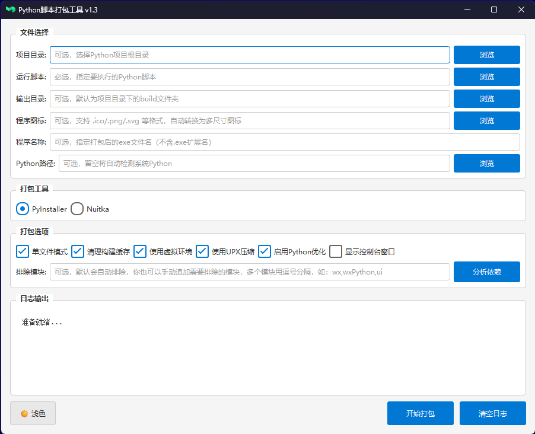
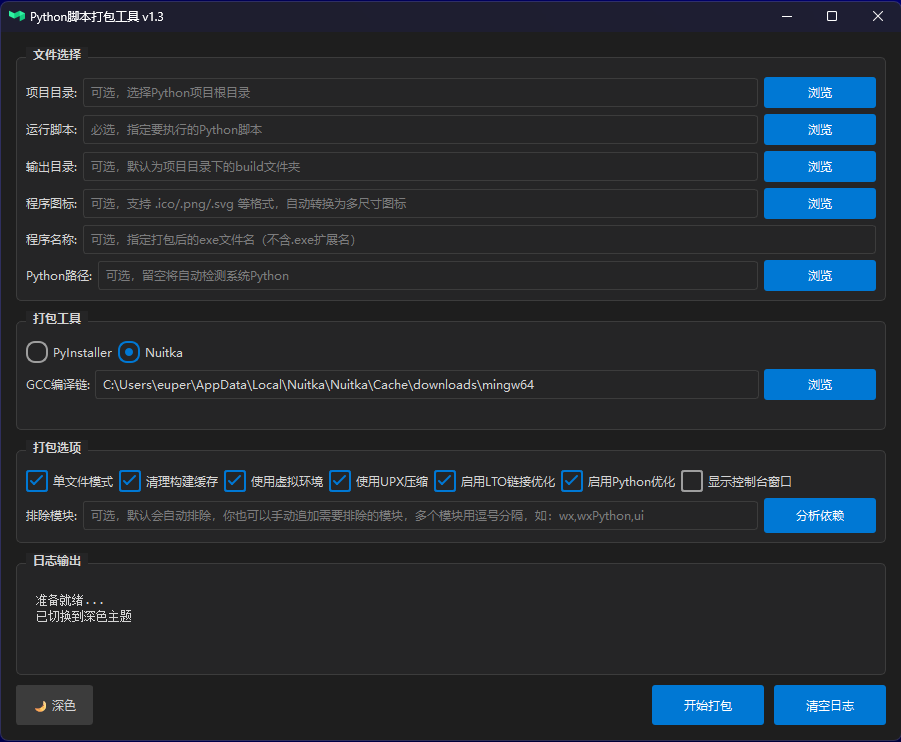

# Python Packaging Tool

<div align="center">


一个功能强大的图形化Python打包工具，支持PyInstaller和Nuitka双引擎

[功能特点](#功能特点) • [安装使用](#快速开始) • [使用指南](#使用说明) • [常见问题](#常见问题) • [贡献指南](#贡献指南)

</div>

---

## 📖 目录

- [功能特点](#功能特点)
- [系统要求](#系统要求)
- [快速开始](#快速开始)
- [使用说明](#使用说明)
- [打包工具对比](#打包工具对比)
- [项目结构](#项目结构)
- [技术栈](#技术栈)
- [常见问题](#常见问题)
- [开发指南](#开发指南)
- [贡献指南](#贡献指南)
- [更新日志](#更新日志)
- [许可证](#许可证)
- [鸣谢](#鸣谢)

---

## 📸 界面预览

<div align="center">

### 浅色模式



### 深色模式



</div>

---

## ✨ 功能特点

### 🎨 界面与交互

- **现代化GUI界面**：基于PyQt6开发，界面简洁美观
- **深色/浅色主题**：支持主题切换，适应不同使用习惯
- **拖拽支持**：支持文件和目录的拖拽操作
- **实时日志输出**：打包过程可视化，实时查看进度

### 🔍 智能分析

- **自动检测项目结构**：智能识别项目目录、主脚本
- **依赖自动分析**：基于AST语法树分析，精准识别依赖
- **虚拟环境管理**：自动创建和管理独立虚拟环境
- **Python环境检测**：自动查找系统已安装的Python版本
- **常用库深度支持**：内置100+常用库的隐藏导入配置，包括：
  - **Web爬虫**：selenium、scrapy、playwright、requests-html、beautifulsoup4、lxml
  - **Web框架**：flask、django、fastapi、tornado、aiohttp、streamlit、gradio、dash
  - **GUI框架**：PyQt5/6、PySide2/6、tkinter、wxPython、kivy、customtkinter、flet、dearpygui
  - **数据科学**：numpy、pandas、scipy、matplotlib、seaborn、plotly、bokeh、altair、statsmodels
  - **机器学习**：scikit-learn、tensorflow、pytorch、transformers、xgboost、lightgbm、catboost、onnxruntime
  - **数据库**：pymongo、redis、pymysql、psycopg2、sqlalchemy、motor、aiomysql、aiopg、peewee、alembic、sqlmodel
  - **办公文档**：openpyxl、python-docx、python-pptx、PyPDF2、pdfplumber、pymupdf、reportlab、xlrd、xlwt
  - **任务调度**：celery、apscheduler、schedule
  - **实用工具**：loguru、tqdm、click、typer、colorama、jieba、qrcode、faker、pydantic、marshmallow、tenacity
  - **网络请求**：requests、httpx、aiohttp、websocket、paramiko、uvloop、httptools、gunicorn
  - **图像处理**：Pillow、opencv-python、imageio、pytesseract、easyocr
  - **音频处理**：pygame、pyglet、sounddevice、soundfile、pyaudio、pydub
  - **游戏开发**：pygame、pyglet、arcade、panda3d、ursina
  - **系统交互**：pywin32、pyautogui、pynput、keyboard、mouse、comtypes、pythonnet
  - **缓存序列化**：joblib、dill、cloudpickle、cachetools、diskcache
  - **日期时间**：arrow、pendulum、pytz、python-dateutil
  - **文本处理**：markdown、mistune、pyyaml、toml、python-dotenv

### 🛡️ 三层防护机制

为确保所有库（包括未预配置的库）都能正常打包运行，工具实现了智能三层防护：

1. **第一层：动态模块追踪**
   - 自动检测脚本是否可运行
   - 运行时追踪所有实际导入的模块
   - 捕获动态导入（`__import__`、`importlib`）
   - 脚本不可运行时自动切换到通用策略

2. **第二层：自动收集子模块**
   - 对未配置的库自动收集所有子模块
   - PyInstaller 使用 `--collect-all` 完整收集
   - Nuitka 使用 `--include-package` 包含整个包
   - 添加常见子模块模式（utils、core、base、main 等）

3. **第三层：失败重试机制**
   - 打包后自动测试运行 exe
   - 检测 `ModuleNotFoundError` 并提取缺失模块
   - 自动添加缺失模块并重新打包（最多重试2次）
   - 确保最终生成的程序能正常运行

### 🚀 智能优化

- **模块自动排除**：智能排除测试工具、开发包等非必要模块
- **大小分析**：显示每个依赖包的实际大小
- **优化建议**：生成详细的优化报告和预期效果
- **减少打包体积**：自动优化可减小10%-40%的体积

### 🔧 双引擎支持

- **PyInstaller**：快速打包，兼容性好
- **Nuitka**：编译型打包，性能优秀
- **GCC自动下载**：支持根据系统架构自动下载GCC工具链
- **多镜像源**：智能切换pip镜像源，提升依赖安装速度

### ⚙️ 灵活配置

- 单文件/目录模式切换
- 控制台窗口显示选项
- 自定义程序图标
- UPX压缩支持
- 构建缓存管理

---

## 💻 系统要求

| 项目           | 要求                                      |
| -------------- | ----------------------------------------- |
| **操作系统**   | Windows 10/11 (64位)                      |
| **Python版本** | 3.7 或更高 (推荐 3.10+)                   |
| **磁盘空间**   | 至少 2GB 可用空间                         |
| **内存**       | 推荐 4GB 以上                             |
| **依赖**       | PyQt6, requests 等（见 requirements.txt） |

> **注意**：Nuitka打包需要GCC工具链（约250MB），工具会自动下载

---

## 🚀 快速开始

### 方式一：使用批处理脚本（推荐新手）

1. **下载项目**

   ```bash
   git clone https://github.com/your-username/python_packaging_tool.git
   cd python_packaging_tool
   ```

2. **运行启动脚本**

   ```bash
   run.bat
   ```

   脚本会自动完成以下操作：
   - ✅ 检查Python环境
   - ✅ 创建虚拟环境
   - ✅ 安装所需依赖
   - ✅ 启动程序

### 方式二：手动安装

1. **克隆项目**

   ```bash
   git clone https://github.com/your-username/python_packaging_tool.git
   cd python_packaging_tool
   ```

2. **创建虚拟环境**（推荐）

   ```bash
   python -m venv .venv
   .venv\Scripts\activate
   ```

3. **安装依赖**

   ```bash
   pip install -r requirements.txt
   ```

4. **运行程序**
   ```bash
   python main.py
   ```

---

## 📘 使用说明

### 基本工作流程

```
1. 选择项目/脚本 → 2. 配置打包选项 → 3. 开始打包 → 4. 获取EXE文件
```

<div align="center">


_主界面 - 选择文件、配置选项、开始打包_

</div>

### 详细步骤

#### 1️⃣ 选择文件

| 选项           | 说明                     | 是否必选                   |
| -------------- | ------------------------ | -------------------------- |
| **项目目录**   | Python项目的根目录       | 可选                       |
| **运行脚本**   | 主Python脚本（入口文件） | ✅ 必选                    |
| **输出目录**   | EXE文件存放位置          | 可选（默认：`项目/build`） |
| **程序图标**   | `.ico`格式图标           | 可选                       |
| **Python路径** | 指定Python解释器         | 可选（自动检测）           |

> 💡 **提示**：选择项目目录后，工具会自动尝试查找 `main.py` 和 `icon.ico`

#### 2️⃣ 选择打包工具

**PyInstaller（推荐初学者）**

- ✅ 安装简单，无需额外配置
- ✅ 打包速度快（通常1-5分钟）
- ✅ 兼容性好，支持大多数Python包
- ⚠️ 生成的EXE体积较大

**Nuitka（推荐生产环境）**

- ✅ 生成的EXE体积更小
- ✅ 运行速度更快（编译为C代码）
- ✅ 更好的代码保护
- ⚠️ 首次需要下载GCC工具链（约250MB）
- ⚠️ 打包时间较长（通常5-15分钟）

> 💡 **GCC工具链**：工具会根据系统架构（x86_64/i686）自动下载对应版本

#### 3️⃣ 配置打包选项

- ✅ **单文件模式**：将所有文件打包成单个EXE（默认勾选）
- ✅ **显示控制台窗口**：调试时建议勾选
- ✅ **清理构建缓存**：确保每次打包是全新的
- ✅ **使用UPX压缩**：可减小EXE体积，但可能增加启动时间

#### 4️⃣ 执行打包

1. **（可选）分析依赖**
   - 点击"分析依赖"查看项目依赖
   - 查看优化建议和包大小分析
   - 确认依赖是否正确

2. **开始打包**
   - 点击"开始打包"启动打包流程
   - 实时查看日志输出
   - 等待打包完成

3. **获取EXE**
   - 打包成功后会自动打开输出目录
   - 双击EXE文件测试运行

---

## ⚖️ 打包工具对比

| 特性     | PyInstaller     | Nuitka        |
| -------- | --------------- | ------------- |
| 安装难度 | ⭐⭐⭐⭐⭐ 简单 | ⭐⭐⭐ 中等   |
| 打包速度 | ⭐⭐⭐⭐ 快     | ⭐⭐ 较慢     |
| EXE体积  | ⭐⭐ 较大       | ⭐⭐⭐⭐ 小   |
| 运行速度 | ⭐⭐⭐ 正常     | ⭐⭐⭐⭐⭐ 快 |
| 兼容性   | ⭐⭐⭐⭐⭐ 好   | ⭐⭐⭐⭐ 较好 |
| 代码保护 | ⭐⭐ 弱         | ⭐⭐⭐⭐ 强   |
| 误报率   | ⭐⭐ 较高       | ⭐⭐⭐⭐ 低   |

**选择建议**：

- 🎯 **快速原型/测试** → PyInstaller
- 🎯 **生产环境/发布** → Nuitka
- 🎯 **网络受限** → 手动下载GCC后使用Nuitka
- 🎯 **兼容性优先** → PyInstaller

---

## 📁 项目结构

```
python_packaging_tool/
├── 📄 main.py                    # 程序入口
├── 📄 requirements.txt           # 项目依赖列表
├── 📄 README.md                  # 说明文档
├── 📄 run.bat                    # Windows启动脚本
├── 📄 build_universal.bat        # 构建脚本
├── 📄 .gitignore                 # Git忽略配置
├── 📄 pyproject.toml             # 项目元数据
│
├── 📁 gui/                       # GUI界面模块
│   ├── __init__.py
│   ├── main_window.py            # 主窗口（核心UI）
│   ├── 📁 controllers/           # 控制器
│   │   ├── __init__.py
│   │   └── workers.py            # 后台工作线程
│   ├── 📁 styles/                # 样式主题
│   │   ├── __init__.py
│   │   └── themes.py             # 主题管理器
│   └── 📁 widgets/               # 自定义组件
│       ├── __init__.py
│       └── icons.py              # 图标生成器
│
├── 📁 core/                      # 核心功能模块
│   ├── __init__.py
│   ├── packager.py               # 打包器（PyInstaller/Nuitka）
│   └── dependency_analyzer.py    # 依赖分析器（AST解析）
│
├── 📁 utils/                     # 工具模块
│   ├── __init__.py
│   ├── python_finder.py          # Python环境查找
│   ├── dependency_manager.py     # 依赖管理器
│   └── gcc_downloader.py         # GCC工具链下载器
│
├── 📁 resources/                 # 资源文件
│   └── 📁 icons/                 # 图标资源
│       ├── icon.ico              # 应用图标
│       ├── check_dark.png        # 深色主题复选框
│       ├── check_light.png       # 浅色主题复选框
│       ├── radio_dark.png        # 深色主题单选框
│       └── radio_light.png       # 浅色主题单选框
│
├── 📁 config/                    # 配置文件（运行时生成）
├── 📁 tests/                     # 测试文件
└── 📁 .venv/                     # 虚拟环境（运行时生成）
```

---

## 🛠️ 技术栈

### 核心技术

| 技术            | 用途         | 版本   |
| --------------- | ------------ | ------ |
| **Python**      | 开发语言     | 3.7+   |
| **PyQt6**       | GUI框架      | 6.0+   |
| **PyInstaller** | 打包工具     | 最新   |
| **Nuitka**      | 编译打包工具 | 最新   |
| **AST**         | 代码分析     | 标准库 |

### 主要依赖

```
PyQt6>=6.0.0
requests>=2.28.0
darkdetect>=0.8.0
Pillow>=9.0.0
```

### 架构特点

- **MVC架构**：界面与逻辑分离
- **多线程**：后台任务不阻塞UI
- **插件化设计**：易于扩展新的打包工具
- **模块化**：各功能模块独立，便于维护

---

## ❓ 常见问题

<details>
<summary><b>Q: 为什么打包后的EXE文件很大？</b></summary>

**A:** EXE文件大小受多个因素影响：

1. **依赖包体积**
   - 点击"分析依赖"查看包大小
   - 移除不必要的大型依赖（如numpy、pandas等）

2. **打包模式**
   - 单文件模式会包含Python解释器（约30-50MB）
   - 改用目录模式可减小主程序体积

3. **优化建议**
   - 使用Nuitka代替PyInstaller（体积减少30-50%）
   - 启用UPX压缩（额外减少20-30%）
   - 工具会自动排除测试模块和开发工具

</details>

<details>
<summary><b>Q: 提示找不到Python环境怎么办？</b></summary>

**A:** 解决方法：

1. **检查Python安装**

   ```bash
   python --version
   ```

2. **添加到PATH**
   - 重新安装Python，勾选"Add Python to PATH"
   - 或手动添加Python路径到系统环境变量

3. **手动指定路径**
   - 在工具中点击"Python路径"旁的"浏览"
   - 选择`python.exe`的完整路径

</details>

<details>
<summary><b>Q: Nuitka打包失败，提示找不到GCC？</b></summary>

**A:** 解决方法：

1. **自动下载（推荐）**
   - 点击"自动下载"按钮
   - 等待GCC工具链下载完成（首次约250MB）

2. **手动下载**
   - 访问：https://github.com/brechtsanders/winlibs_mingw/releases/latest
   - 下载对应系统架构的版本：
     - 64位系统：`winlibs-x86_64-posix-seh-*.zip`
     - 32位系统：`winlibs-i686-posix-dwarf-*.zip`
   - 解压到：`C:\Users\你的用户名\AppData\Local\Nuitka\Nuitka\Cache\downloads\`
   - 使用"浏览"按钮选择解压后的`mingw64`或`mingw32`目录

</details>

<details>
<summary><b>Q: 打包的程序被杀毒软件报毒？</b></summary>

**A:** 解决方法：

1. **使用Nuitka**：Nuitka生成的EXE误报率更低
2. **代码签名**：为EXE添加数字签名（需要购买证书）
3. **添加信任**：将EXE添加到杀毒软件白名单
4. **申诉误报**：向杀毒软件厂商提交误报申诉

> **说明**：PyInstaller打包的程序容易被误报，这是行业通病，不是本工具的问题

</details>

<details>
<summary><b>Q: 打包后的程序无法运行？</b></summary>

**A:** 排查步骤：

1. **查看错误信息**
   - 勾选"显示控制台窗口"重新打包
   - 双击EXE查看控制台输出的错误

2. **检查依赖**
   - 点击"分析依赖"确认所有依赖都已识别
   - 确保虚拟环境中所有依赖都已安装

3. **测试环境**
   - 在其他电脑上测试，排除环境问题
   - 检查是否缺少VC++运行库

4. **查看日志**
   - 查看打包日志中的警告和错误
   - 搜索关键错误信息

</details>

<details>
<summary><b>Q: 支持Linux和macOS吗？</b></summary>

**A:** 目前仅支持Windows平台。

- Linux/macOS支持正在计划中
- 您可以在这些系统上使用命令行直接调用PyInstaller或Nuitka
- 欢迎贡献跨平台支持的PR

</details>

<details>
<summary><b>Q: 如何减少打包时间？</b></summary>

**A:** 优化建议：

1. **使用虚拟环境**：只安装必要的依赖
2. **启用缓存**：不要每次都勾选"清理构建缓存"
3. **排除大型包**：如不需要pandas、numpy等大型库，不要安装
4. **选择PyInstaller**：Nuitka打包时间比PyInstaller长3-5倍

</details>

---

## 👨‍💻 开发指南

### 环境搭建

```bash
# 1. 克隆项目
git clone https://github.com/your-username/python_packaging_tool.git
cd python_packaging_tool

# 2. 创建虚拟环境
python -m venv .venv

# 3. 激活虚拟环境（Windows）
.venv\Scripts\activate

# 4. 安装开发依赖
pip install -r requirements.txt

# 5. 运行程序
python main.py
```

### 代码规范

- 遵循 PEP 8 代码风格
- 使用类型提示（Type Hints）
- 编写文档字符串（Docstrings）
- 单元测试覆盖核心功能

### 调试技巧

```python
# 启用调试模式
python main.py --debug

# 查看依赖分析详情
python -c "from core.dependency_analyzer import DependencyAnalyzer; print(DependencyAnalyzer.__doc__)"
```

### 构建发布版本

```bash
# 使用构建脚本打包工具本身
build_universal.bat
```

---

## 🤝 贡献指南

我们欢迎各种形式的贡献！

### 贡献方式

- 🐛 **报告Bug**：在Issues中描述问题和复现步骤
- 💡 **提出建议**：在Issues中描述新功能需求
- 📖 **改进文档**：修正错误或补充说明
- 💻 **提交代码**：通过Pull Request贡献代码

### Pull Request流程

1. **Fork项目**

   ```bash
   # 点击GitHub页面右上角的Fork按钮
   ```

2. **创建分支**

   ```bash
   git checkout -b feature/your-feature-name
   ```

3. **提交更改**

   ```bash
   git add .
   git commit -m "feat: 添加某某功能"
   ```

4. **推送分支**

   ```bash
   git push origin feature/your-feature-name
   ```

5. **创建Pull Request**
   - 在GitHub上创建PR
   - 填写详细的描述
   - 等待代码审查

### Commit规范

使用[约定式提交](https://www.conventionalcommits.org/zh-hans/)规范：

```
feat: 新功能
fix: 修复Bug
docs: 文档更新
style: 代码格式调整
refactor: 代码重构
test: 测试相关
chore: 构建/工具链相关
```

### 行为准则

- 尊重他人，友善交流
- 建设性地提出意见
- 接受代码审查的反馈
- 遵守开源协议

---

## 📝 更新日志

### v1.5.1 (最新)

**🔧 维护更新**

- 修复若干小问题
- 优化代码稳定性

### v1.4.0

**🚀 重大更新：Nuitka 官方最佳实践集成**

基于 [Nuitka 官方文档](https://nuitka.net/user-documentation/) 进行全面优化：

- ✨ **Anti-bloat 配置（减少依赖膨胀）**
  - 自动排除 pytest、setuptools、unittest、IPython、dask 等开发/测试包
  - 支持自定义排除模块列表
  - 大幅减少编译时间和最终文件体积

- ✨ **Python 标志优化**
  - `--python-flag=no_docstrings`：移除文档字符串
  - `--python-flag=no_asserts`：禁用断言语句
  - `--python-flag=no_warnings`：禁用运行时警告（可选）
  - `--python-flag=no_annotations`：移除类型注解（可选）

- ✨ **部署模式支持**
  - `--deployment` 选项移除所有调试助手
  - 适用于生产环境发布，减小文件体积

- ✨ **Onefile 临时目录配置**
  - 支持 `--onefile-tempdir-spec` 配置
  - 使用缓存目录避免 Windows 防火墙每次询问
  - 可用变量：`{CACHE_DIR}`, `{COMPANY}`, `{PRODUCT}`, `{VERSION}` 等

- ✨ **编译报告生成**
  - 支持 `--report` 生成 XML 编译报告
  - 包含模块使用、时间统计等信息，便于问题诊断

- ✨ **用户包配置文件支持**
  - 支持 `--user-package-configuration-file` 自定义 YAML 配置
  - 处理特殊第三方包的数据文件和 DLL 需求

- ✨ **低内存模式**
  - `--low-memory` 选项减少编译时内存使用
  - 适用于内存有限的系统

- 🔧 **新增 Nuitka 高级选项对话框**
  - 图形化配置所有最佳实践选项
  - 实时预览命令行参数
  - 支持重置为默认设置

- 📦 **新增模块**
  - `core/nuitka_config.py`：Nuitka 配置数据类和最佳实践
  - `gui/dialogs/nuitka_options_dialog.py`：高级选项配置对话框

### v1.3.0

**🛡️ 重大更新：三层防护机制**

- ✨ **第一层：动态模块导入追踪**
  - 自动检测脚本是否可运行
  - 运行时追踪所有实际导入的模块
  - 捕获动态导入（`__import__`、`importlib`）
  - 脚本不可运行时自动切换到通用策略

- ✨ **第二层：自动收集子模块**
  - 对未配置的库自动收集所有子模块
  - PyInstaller 使用 `--collect-all` 完整收集
  - Nuitka 使用 `--include-package` 包含整个包
  - 添加11种常见子模块模式（utils、core、base、main、api、models 等）

- ✨ **第三层：失败重试机制**
  - 打包后自动测试运行 exe
  - 检测 `ModuleNotFoundError` 并提取缺失模块名
  - 自动添加缺失模块并重新打包（最多重试2次）
  - 确保最终生成的程序能正常运行

- 🔧 **技术改进**
  - 新增已配置库列表（168个库）用于智能判断
  - 未配置的库自动使用通用策略
  - 增强 PyInstaller/Nuitka 的 Analysis 阶段
  - 支持所有 Python 第三方库（不限于预配置列表）

### v1.2.0

**🎉 继续扩展：新增48个常用库支持**

- ✨ **新增48个库的深度支持（总计100+库）**
  - **PDF处理**: pymupdf (fitz)、reportlab
  - **Markdown**: markdown、mistune
  - **OCR识别**: pytesseract、easyocr
  - **AI推理**: onnxruntime
  - **数据可视化**: gradio、streamlit、dash、bokeh、altair
  - **数据库ORM**: sqlmodel、alembic、peewee、motor、aiomysql、aiopg
  - **性能优化**: httptools、uvloop、gunicorn
  - **日期时间**: pytz、python-dateutil
  - **工具库**: faker、attrs、pydantic、marshmallow、tenacity、retrying
  - **缓存**: cachetools、diskcache、joblib、dill、cloudpickle
  - **游戏开发**: pygame (25个子模块)、pyglet、arcade、panda3d、ursina
  - **系统交互**: pythonnet、comtypes、pynput、keyboard、mouse
  - **音频处理**: sounddevice、soundfile、pyaudio、pydub

- 📊 **统计数据**
  - 新增197个隐藏导入配置
  - 累计支持100+常用库
  - 累计668+个隐藏导入自动配置

### v1.1.0

**🎉 重大更新：增强常用库支持**

- ✨ **新增50+常用库的深度支持**
  - 自动为这些库添加必要的隐藏导入，无需手动配置
  - 支持 selenium、scrapy、playwright 等 Web 爬虫框架
  - 支持 flask、django、fastapi 等 Web 开发框架
  - 支持 PyQt、tkinter、kivy 等多种 GUI 框架
  - 支持 numpy、pandas、tensorflow、pytorch 等数据科学和机器学习库
  - 支持 openpyxl、python-docx、PyPDF2 等办公文档处理库

- 🐛 **修复 selenium 打包问题**
  - 解决打包后运行提示 "ModuleNotFoundError: No module named 'selenium'" 的问题
  - 自动包含所有 selenium 子模块（webdriver、common、support 等）
  - 确保 Chrome、Firefox、Edge 等浏览器驱动正常工作

- 🔧 **优化依赖分析**
  - 新增471个常用库的隐藏导入配置
  - 智能识别库的依赖关系
  - 自动包含运行时动态加载的模块

---

## 📄 许可证

本项目采用 [GPL (v3) 协议] 。

---

## 🙏 鸣谢

本项目的开发离不开以下优秀的开源项目：

- [PyQt6](https://www.riverbankcomputing.com/software/pyqt/) - 强大的Python GUI框架
- [PyInstaller](https://www.pyinstaller.org/) - Python打包工具
- [Nuitka](https://nuitka.net/) - Python到C编译器
- [winlibs_mingw](https://github.com/brechtsanders/winlibs_mingw) - Windows GCC工具链
- [darkdetect](https://github.com/albertosottile/darkdetect) - 系统主题检测

感谢所有贡献者的辛勤付出！

---

## 📮 联系方式

- **Issues**: [GitHub Issues](https://github.com/your-username/python_packaging_tool/issues)
- **Discussions**: [GitHub Discussions](https://github.com/your-username/python_packaging_tool/discussions)
- **Email**: nginx11724@qq.com

---

<div align="center">

**如果这个项目对你有帮助，请给一个 ⭐️ Star！**

Made with ❤️ by Python Packaging Tool Contributors

[⬆ 回到顶部](#python-packaging-tool)

</div>
